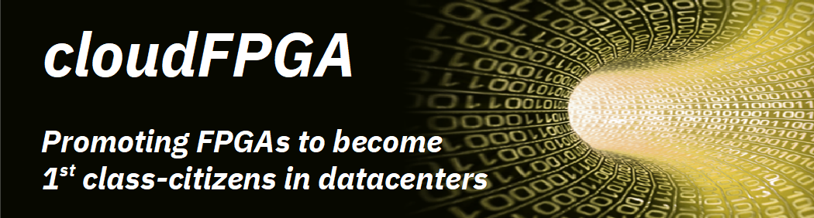
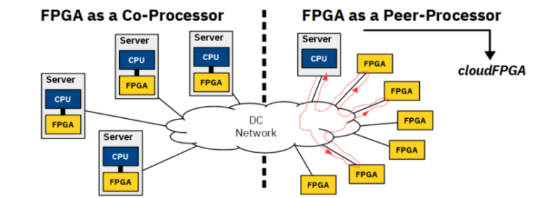
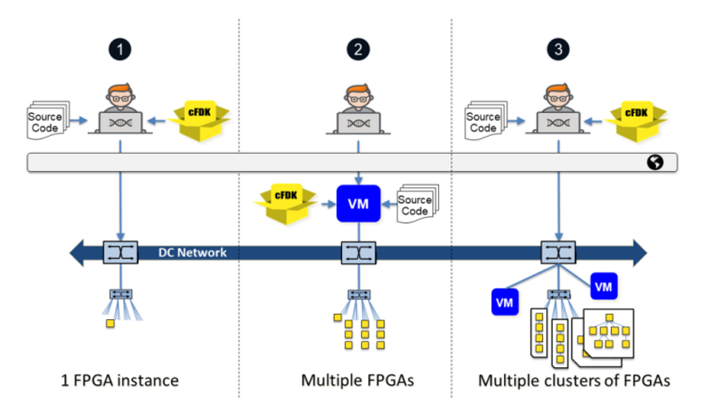

Welcome to **_cloudFPGA_**. This organization hosts a set of repositories and projects related to 
 the [*_cloudFPGA system_*](https://www.zurich.ibm.com/cci/cloudFPGA/), a disaggregated data processing platform based on standalone and network 
 attached FPGAs in the Cloud.
 
 For users to experiment, design and build hardware accelerated applications with _cloudFPGA_, we 
 provide a 
 [**_cloudFPGA Development Kit (cFDK)_**](#overview-of-the-cloudfpga-development-kit-(cfdk)) 
 and we grant free access to instances of our 
 [**_cloudFPGA Research Platform (cFRP)_**](#overview-of-the-cloudfpga-research-platform-(cfrp)) 
 in the Cloud.
 
# Table of Contents
1. [About cloudFPGA](#about-cloudfpga)
    * [Overview of the Cloud Service Architecture](#overview-of-the-cloud-service-architecture)
    * [Overview of the Development Flow](#overview-of-the-development-flow)
    * [Overview of the cloudFPGA Research Platform (cFRP)](#overview-of-the-cloudfpga-research-platform-cfrp)
    * [Overview of the cloudFPGA Development Kit (cFDK)](#overview-of-the-cloudfpga-development-kit-cfdk)
2. [About this Organization](#about-this-organization)
    * [How to contribute](#how-to-contribute)
3. [Documentation](#documentation)
    * [Getting Started](#getting-started)
4. [Contact and Support](#contact-and-support)

# About _cloudFPGA_
The **_cloudFPGA (cF)_** proposal is to promote FPGAs to become 1st class-citizens in **_datacenters
 (DC)_** by setting the FPGAs free from the traditional CPU-bus attachments and by making them 
 plentiful in modern hyperscale DCs. 
* The first proposition is carried out by disaggregating the FPGAs from the server nodes and by 
  connecting the FPGAs directly to the DC network. As a result, FPGAs can communicate with other 
  CPUs and FPGAs in the DC network with low latency and high bandwidth .
  
* The second is achieved by turning the FPGAs into standalone network attached FPGAs while densely
  packing them into DC chassis and racks. From that prospect, FPGAs become autonomous and 1st class-compute
  nodes that can be reached anywhere in the DC via their IP address. 
  
 
## Overview of the Cloud Service Architecture

In the cloud computing universe, a **CPU Instance** is a hardware resource (such as a server or a 
virtual machine) combined with the image of an operating system (such as _Linux_ or _Windows_). 
Next, different types of CPU instances are offered in the Cloud based on varying hardware capabilities 
such as clock frequency, #cores, memory size, computing power, etc. Finally, when deploying a workload 
on the Cloud, users select the CPU instance that best matches the requirements of their application.
 
The cloud service architecture of cloudFPGA is comparable to a cloud service hosting traditional 
servers and virtual machines when considering the following case of correlation:
* in cF, the equivalent of the CPU-based hardware resource is an _FPGA device_ and its surrounding 
  board components. We refer to such an FPGA card as an **FPGA module (MOD)**. 
* in cF, the equivalent of the OS image is a _bitstream_ that contains the custom interfaces and
  run-time logic to host and run a workload. We refer to such a design as a *Shell*. 
 
As a result, the counter part of a CPU instance is an FPGA Instance and we can draw the following 
parallels:

|                 |                             |
|-----------------|-----------------------------| 
|**CPU_Instance** |= **Hw_Resource + OS_Image** |
|**CPU_Cluster**  |= **N * CPU_Instances**      |
|**FPGA_Instance**|= **FPGA_Module + Shell**    |
|**FPGA_Cluster** |= **N * FPGA_Instances**     |
 
## Overview of the Development Flow

A cloudFPGA application is referred to as a **_Role (ROL)_** and it is typically deployed using 
 **_Partial Reconfiguration (PR)_** over the DC network. The various design flows for developing and 
 deploying partial bitstreams of such ROL applications are presented in the figure below.  
 * the leftmost situation depicts a user working on its local **desktop** to develop his application
   and later deploy it on a single cloudFPGA instance (represented here as a little _yellow_ square 
   box at the bottom of the figure). In this _on-premise_ scenario, the user's desktop is expected 
   to supervise the FPGA instance and to feed it with appropriate data and commands.    
 * the middle case shows a user developing on a **_Virtual Machine (VM)_** hosted in the Cloud and 
   later deploying the same application on multiple cF instances. Obviously, the preferred way to 
   manage these duplicated cF instances is to use that same VM or a similar one in the Cloud. 
 * the rightmost columns exemplifies a user who is deploying **multiple VMs** as well as **multiple 
   clusters of FPGAs** in the Cloud.
   

## Overview of the cloudFPGA Research Platform (cFRP)
 
The **_cloudFPGA Research Platform (cFRP)_** is a 2U height by 19 inches wide chassis featuring 64 
 FPGA instances. The chassis is equipped with two **_sleds (S0, S1)_**, each sled consisting of 
 32 FPGA instances connected to an Intel FM6000 switch via a carrier board. The FM6000 acts as a 
 leaf switch that aggregates 32x10GbE links from the FPGAs and exposes them to a higher-level spin 
 network via 8x40GbE up-links. This amounts to a bi-sectional bandwidth of 640 Gb/s per sled.

Next, a **_cloudFPGA Infrastructure_** consists of multiple such cFRMs assembled into numerous DC racks.
 

 
Note that knowledge of the cFRP is not required for developing with cloudFPGA. The only concept that 
 a user must grasp, is that IP-based switching and routing among FPGAs and CPU servers provide DC-wide 
 end-to-end connectivity and flexibility. 

However, the above cFRP details might be relevant to advanced users who seek ultra low-latency and 
 who may want to deploy their cluster on FPGAs which are spatially close in a sled, a chassis or a rack. 

## Overview of the cloudFPGA Development Kit (cFDK)

A cloudFPGA application builds on the design pattern referred to as **_Shell Role 
 Architecture (SRA)_**. This design separates the platform-specific parts (i.e. _Shell_) from the 
 application-specific parts (i.e. _Role_) to increase the re-usability and to isolate the two parts. 

* The **_Shell (SHL)_** contains all necessary I/O components, the run-time modules and the network stack 
 that hooks the FPGA to the DC network. It further abstracts all these hardware components by exposing 
 standard _AXI interfaces_ to the user. From a computer operating system perspective, the SHL can be 
 seen as the conceptual counterpart of the kernel space.

* The **_Role_ (ROL)** is the application-specific part of the FPGA logic. It embeds the user's custom 
 application and can be assimilated to a CPU application executed in user space. 

cloudFPGA is designed to support multiple combinations of shell-role architectures on various 
 [FPGA instances (MOD)](#cloudfpga-service-architecture). Once a designer has decided for a _MOD_ and a _SHL_ to run
 his _ROL_, it is the purposes of the **_cloudFPGA Development Kit (cFDK)_** to assemble the tuple 
 _{MOD, SHL, ROL}_ into a so-called **_cloudFPGA Project (cFp)_**.     

The cFDK [repository](https://github.ibm.com/cloudFPGA/cFDK/) contains source code, documentation, 
simulation and all the build scripts that are necessary to create such a cloudFPGA project. 

#### User Privilege Layers
Depending on the commitment sought by the user, the cFDK offers two kind of development experiences 
characterized by different levels of protection.

* **common users** are unprivileged users who use the development kit to build their custom 
  hardware accelerated application, generate an FPGA bitstream and run it on a cloudFPGA instance. 
* **privileged users** are granted the right to modify an existing shell or to create one with new
   features. This status must be requested and authorized by the cF team. 
 
Warning: The cFDK is only available for **Linux** operating systems.

  
# About this Organization
This _GitHub_ organization is a central places for hosting cloudFPGA projects and repositories, 
 as well as the cloudFPGA development kit required to build and deploy hardware 
 accelerated applications on a cluster of standalone network-attached FPGAs in the Cloud.
 The following repositories can be found in the current organization:
 * `[cFDK]` is the [cloudFPGA development kit](#overview-of-the-cloudfpga-development-kit-cfdk). It 
    contains a framework to help implement your FPGA application on a 
    [cloudFPGA research platform](#overview-of-the-cloudfpga-research-platform-cfrp).
 * `[cFBuild]` can be used for creating or updating a _cloudFPGA project_ (cFp) based on
    the **_cFDK_**.
 * `[cFp_<ProjectName>]` are a set of projects developed by the cloudFPGA community and provided here
    as reference 
 * `[Doc]` contains the file that you are reading. This repository is also used to build
    the cloudFPGA documentation which is provided as GitHub pages under the 
    [Documentation](#documentation) section.
 * `[Dox]` is a repository for generating _Doxygen_ related HTML static pages for the cFDK. 

## How to Contribute
    [TODO]

# Documentation
The cloudFPFA documentation is provided as GitHub pages at:
 * **https://pages.github.ibm.com/cloudFPGA/Doc/**
 
FYI - The documentation is automatically compiled and re-generated after a commit to this repository. 
However, if you need to re-build and update this documentation locally, please checkout the file 
**[BuildDoc.md](./BuildDoc.md)**.

## Getting Started
If you are new to _cF_, we recommend you start as an _[unprivileged user](#user-privilege-layers)_ 
and clone one of the following example designs which provide a step-by-step quick start guide. 

| cFp_Project        | Description                    
|:-------------------|:---------------------------------------------
| cFp_Echo           | An application that echos the received UDP and TCP traffic back to the initiator node.   
| cFp_Uppercase      | An application that receives a string from a user and returns it back in uppercase. 
| cFp_Triangle       | A triangle communication example between a host and 2 FPGAs. 

cloudFPGA is designed to support different types of shells and FPGA instances. If you are a 
 _[privileged user](#privileged_user)_ who wants to contribute and collaborate at the shell design level
  or at an FPGA module level, please consider going through the following projects:
 
| cFp_Project        | Description                    
|:-------------------|:---------------------------------------------
| cFp_Monolithic     | A project that builds on the shell _[Kale](https://github.ibm.com/cloudFPGA/cFDK/blob/master/DOC/Kale.md)_.   
| cFp_[TODO]         | A project that uses the shell __[Themisto](https://github.ibm.com/cloudFPGA/cFDK/blob/master/DOC/Themisto.md)_. 

# Contact and Support
    [TODO]

