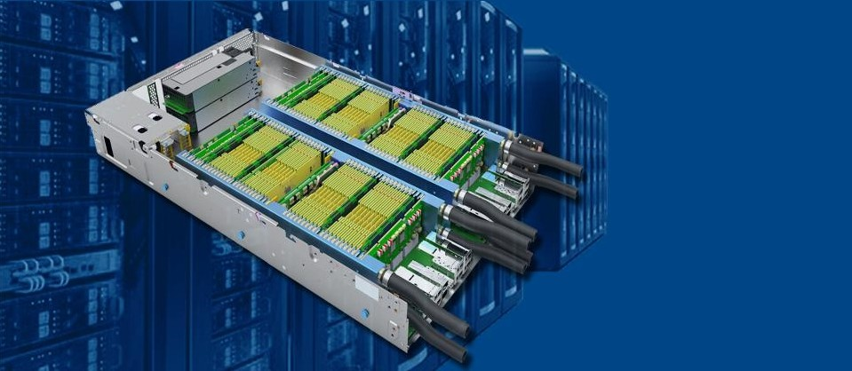

.. cloudFPGA documentation master file, created by
   sphinx-quickstart on Thu Oct 24 10:11:16 2019.
   You can adapt this file completely to your liking, but it should at least
   contain the root `toctree` directive.

Welcome to cloudFPGA documentation
==================================

**cloudFPGA** is a research platform developed at the [IBM Research, Zurich, Switzerland](https://www.zurich.ibm.com/cci/cloudFPGA/).

We built the **cloudFPGA (cF)** system because we wanted to research the use and the deployment of 
standalone network-attached FPGAs into the Cloud, but could not find such an off the shelf hardware.

Now that we have a few cF platforms up and running in our on-prem Cloud, we are willing to share 
them with other researchers around the world. Therefore, if you want to experiment, work with or 
help us develop such a cluster of network-attached FPGAs, please get in touch.

Indices and Search
==================

* :ref:`genindex`
* :ref:`search`

.. comment doxygengroup:: Shell
.. comment    :members:

.. toctree::
   :maxdepth: 8
   :caption: Contents:
   :numbered:

   self
   pages/OVERVIEW/overview
   pages/GETTING_STARTED/getting_started
   pages/CFSPHERE/cfsphere
   pages/cFHW/cfhardware
   pages/PROJECTS/cfprojects
   pages/CONTRIBUTING/contributing
