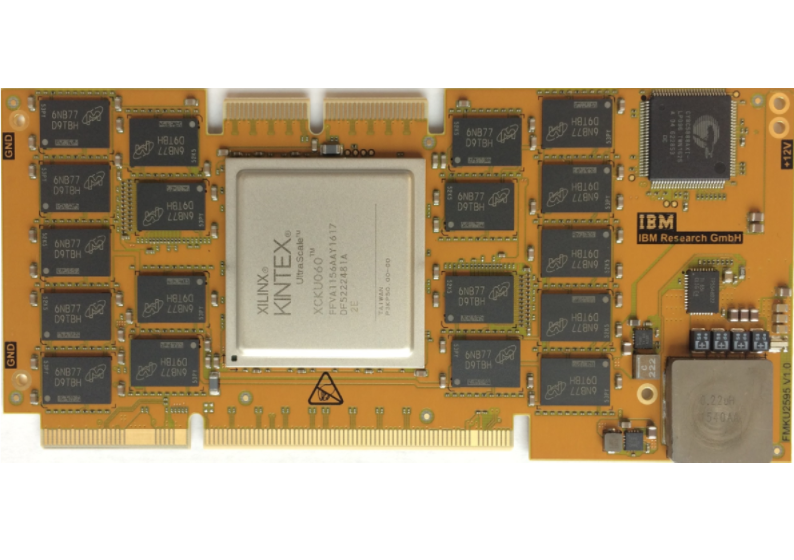
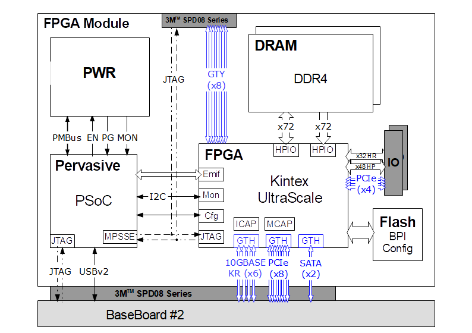

# FMKU60 Module

## Overview

The FMKU60 is an FPGA module that plugs into an [*IBM cloudFPGA Research Platform*](../cFRP/platform.md).
 
The card is equipped with a _Kintex UltraScale XCKU060_ from _Xilinx_ and two banks of 8 GB of _DDR4_
memory.

 

A block diagram of this module is shown in the following image:

  

