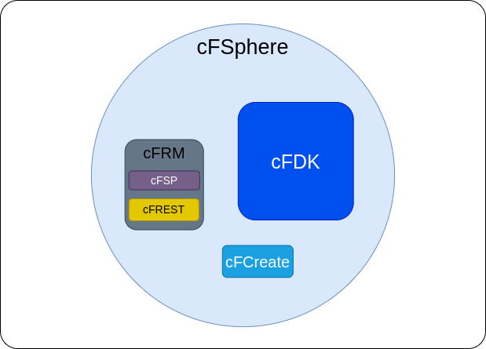

# The cloudFPGA Sphere

The **cloudFPGA Sphere** or **cFSphere** is what constitutes the core of a cloudFPGA system. 
It is composed of several software components, each of them being provided as a standalone 
cF repository.       

* The [cloudFPGA Development Kit (cFDK)](https://cloudfpga.github.io/Doc/pages/CFSPHERE/cfdk.html) 
  provides all the design files that are necessary to instantiate a cloudFPGA **SHELL** once a 
  Shell-Role architecture has been chosen by the user.
  * The cFDK is provided as a cloudFPGA repository [(cFDK Repo)](https://github.com/cloudFPGA/cFDK/) 
    and the documentation of its API is available in Doxygen style 
    [(cFDK Dox)](https://cloudfpga.github.io/Dox/index.html) 
  

* The **cloudFPGA Resource Manager (cFRM)** is a software component for acquiring, distributing, 
  configuring and operating our stand-alone network-attached FPGAs in the DC infrastructure. 
  This is a complex 3-tier hierarchical architecture 
  [\[Ringlein-2019\]](https://www.zurich.ibm.com/pdf/fpga/FPL_2019.pdf) for which we provide the
  following two RESTful web APIs for a user to interact with:
  
  * The [cloudFPGA Support Package (cFSP)](https://cloudfpga.github.io/Doc/pages/CFSPHERE/cfsp.html) 
    is a software library for accessing the control and the data path of a cloudFPGA instance. 
    The cFSP is provided as a cloudFPGA repository [(cFSP Repo)](https://github.com/cloudFPGA/cFSP).
  
  * The **cloudFPGA REST (cFREST)** is a graphical web API for the user to access the features 
    provided by the cFRM. This API is available as a Swagger UI with a look and feel similar to 
    this [screenshot](./imgs/cFREST.jpeg).  

  
* The [cloudFPGA Create (cFCreate)](https://cloudfpga.github.io/Doc/pages/CFSPHERE/cfcreate.html) is a framework 
  to assist a user during the creation and the update of a cloudFPGA project. It is also provided
  as a cloudFPGA repository [(cFCreate Rep)](https://github.com/cloudFPGA/cFCreate)
  

For more information on these components, please visit the documentation of the corresponding 
repositories. 
