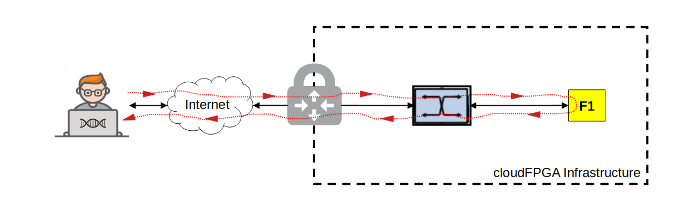

# Getting Started

This quick start guide will take you through two "*Hello World*" examples. The first one 
demonstrates the generation of a static bitstream for a single FPGA and its deployment in 
the cloudFPGA infrastructure. The second exhibits the creation of a cluster of FPGAs operated 
with Partial Reconfiguration (PR) of the application roles. 

Both examples can be cloned, synthesized, placed and routed on your local computer. 
However, you will need to connect to our cloudFPGA infrastructure via a VPN client if you want to 
test your generated bitstreams on a standalone network-attached FPGA. 

:Info: To get access to the cF infrastructure, you must request a cloudFPGA account by registering [here](https://github.com/cloudFPGA/Doc/tree/master/imgs/COMING_SOON.md).   

## How to Monolithic

If you are new to cloudFPGA, we recommend  you start with the deployment of a single FPGA and you 
get yourself a first experience with the network attachment paradigm.  
 
This can be achieved with the project [cFp_HelloKale](https://github.com/cloudFPGA/cFp_HelloKale) 
which demonstrates the generation of a static bitstream for a cloudFPGA instance and its 
deployment in the cF infrastructure.

### Overview

The project builds on the shell [Kale](https://github.com/cloudFPGA/cFDK/blob/main/DOC/Kale.md) 
which is a shell with minimalist support for accessing the hardware components of the FPGA 
instance, and a role that implements a set of TCP and UDP loopback mechanisms for echoing the 
incoming traffic and forwarding it back to its emitter. 

This setup corresponds to an FPGA server implementing a unique UDP and TCP echo service. 
The FPGA accepts connections on port `8803` and echoes every incoming lines back to the client 
(using the carriage-return/line-feed sequence as line separator). The resulting traffic scenario 
is shown in the following figure.

        

### Selecting The Design Development Flow

When you create or clone a cloudFPGA design you can opt to design on your local machine or design 
on a virtual machine hosted in our data center infrastructure 
([as mentioned here](https://cloudfpga.github.io/Doc/pages/OVERVIEW/overview.html#cloudfpga-development-flow)).

:Info: This getting started procedure will exemplify the generation of a cloudFPGA bitstream on your local computer. It is therefore assumed that you have the Xilinx Vivado tools (Vivado 2017.4 or higher) installed and the corresponding licenses for you to use.

### Quick Trial

Step-1: Clone, setup, generate bitstream.
```
$ git clone -recursive git@github.com:cloudFPGA/cFp_HelloKale.git
$ cd cFp_HelloKale
$ source env/setenv.sh
$ make monolithic
``` 

Step-2: Setup cFSP.
```
$ cd .. 
$ git clone git@github.com:cloudFPGA/cFSP.git
$ cd cFSP
$ virtualenv -p /usr/bin/python3.8 cfenv
$ source cfenv/bin/activate
$ pip install -r requirements.txt
$ ./cfsp user load  --username=did --password=****** --project=cf_Test_2  (replace with yours)
``` 

Step-3: Upload bitstream, request instance, ping instance.
```
$ ./cfsp image post --image_file=../cFp_HelloKale/dcps/4_topFMKU60_impl_default_monolithic.bit 
(Note the image id, e.g. `74462cd5-20e3-4228-a47d-258b7e5e583a`)
$ ./cfsp instance post --image_id=<image_id>
(Note the field `role_ip`, e.g. `10.12.200.8`)
$ ping <role_ip>
``` 

Step-4: TCP and UDP Netcat (a.k.a 'nc') 
```
$ which nc
$ nc <role_ip> 8803
...Type in something at the console, it will be echoed back by the TCP I/F of the FPGA...
...Type CTRL-C to quit ...
$ nc <role_ip> -u 8803
...Type in something at the console, it will be echoed back by the UDP I/F of the FPGA...
...Type CTRL-C to quit ...
$ 
```

Step-5: Clean-up by deleting the instance and the image (optional).
```
$ ./cfsp instance delete <instance id>
$ ./cfsp image delete <image id>
```

For more information and a more detailed step-by-step procedure please visit 
[cFp_HelloKale](https://github.com/cloudFPGA/cFp_HelloKale).


## How to Partial Reconfiguration

For the second *Hello-world*, we suggest you to experiment with the deployment of a cluster of 
FPGAs.

This can be achieved with the project [cFp_HelloThemisto](https://github.com/cloudFPGA/cFp_HelloThemisto) 
which demonstrates the generation of a set of partial bitstreams intended for a cluster of 
FPGAs. This cluster is then deployed and its FPGAs are reconfigured via the TCP/IP network of the 
data center.

### Overview

The project builds on the shell [Themisto](https://github.com/cloudFPGA/cFDK/blob/main/DOC/Themisto.md) 
which is a shell with enhanced routing support and a set of roles that implement TCP and a UDP 
forwarding services to the next node in the cluster. 

The setup of this FPGA cluster can be thought as a micro-service architecture in which a few 
loosely coupled FPGAs operate together to achieve a common application goal. In this case, the 
first FPGA of the cluster accepts connections on port `8803` and forwards every incoming lines to 
the next FPGA in the chain. This goes on for every other FPGA in the chain until the last one 
passes the received line back to the host client. The resulting traffic scenario is shown in the 
following figure.

The resulting traffic scenario for a cluster of two FPGAs and one CPU is shown in the following 
figure.


### Selecting The Design Development Flow

This second quickstart example let you generate the FPGA bitstreams of the cluster on your 
computer again, but this time you won't be able to access the cluster without connecting to the 
cloudFPGA infrastructure via VPN.  

:Info: To get access to the cF infrastructure, you must request a cloudFPGA account by registering [here](https://github.com/cloudFPGA/Doc/tree/master/imgs/COMING_SOON.md).   

### Quick Trial

Step-1: Clone, setup, generate bitstream.
```
$ git clone -recursive git@github.com:cloudFPGA/cFp_HelloThemisto.git
$ cd cFp_HelloThemisto
$ source env/setenv.sh
$ ./sra/build pr
``` 

Step-2: Setup cFSP.
```
$ cd .. 
$ git clone git@github.com:cloudFPGA/cFSP.git
$ cd cFSP
$ virtualenv -p /usr/bin/python3.8 cfenv
$ source cfenv/bin/activate
$ pip install -r requirements.txt
$ ./cfsp user load  --username=did --password=****** --project=cf_Test_2
(in the command above add your ZYC2 username, password and project)
``` 

Step-3: Upload bitstream, request cluster. TODO
```
$ cFSP post_image_app_logic(<image_file>, <sig_file>, <pr_verify_rpt>)
$ cFSP post_cluster(<project_name> , <cluster_details>)

$ ./cfsp image post --image_file=../cFp_HelloKale/dcps/4_topFMKU60_impl_default_monolithic.bit 
(In the previous command add to `--image_file` the path to the bitstream which was generated by Step-1.)
(The previous command will upload the bitstream and you will get a hash id, e.g. `74462cd5-20e3-4228-a47d-258b7e5e583a`)
$ ./cfsp cluster post --image_id=<image_id> --node_ip=<node_ip> (replace with yours)
(The previous command will return details of the cluster id, including the instance IP, under the field `role_ip`, e.g. `10.12.200.8`)
``` 


Step-4: Ping instances, TCP Netcat (a.k.a 'nc') 
```
$ ping <fpga_instance_ip1>
$ ping <fpga_instance_ip2>
$ ssh <vm_instance_ip>
...Open a 1st terminal...
$ nc -l 2718
...Open a 2nd terminal...
$ nc -u <fpga_instance_ip2> 2718
...Type in something at the terminal 2, it will be echoed in terminal 1...
...Type CTRL-C to quit...
$ 
```

Step-5: Clean-up by deleting the cluster and the image (optional).
```
$ ./cfsp cluster delete <cluster id>
$ ./cfsp image delete <image id>
```

For more information and a more detailed step-by-step procedure please visit 
[cFp_HelloThemisto](https://github.com/cloudFPGA/cFp_HelloThemisto).
