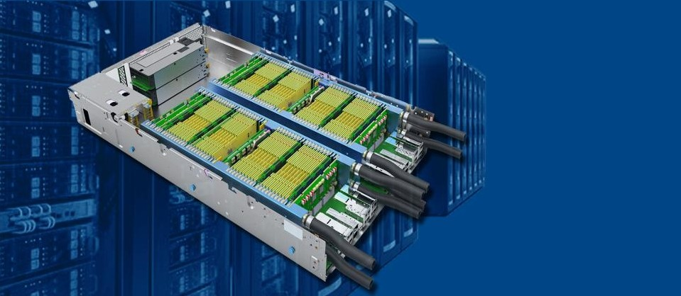

## Introduction

**cloudFPGA** is a disaggregated cloud and computing infrastructure developed at the 
[IBM Research laboratory in Zurich, Switzerland](https://www.zurich.ibm.com/cci/cloudFPGA/).
The goal of this research platform is to deploy FPGAs at large scale in data centers.

### Motivation

We built the **cloudFPGA (cF)** system because we wanted to research the use and the deployment of 
standalone network-attached FPGAs into the Cloud, but could not find such an off the shelf hardware.

Now that we have a few cF platforms up and running in our on-premise Cloud, we are offering to 
share them with other researchers around the world. Therefore, if you want to help us develop, 
experiment, or work with such a cluster of network-attached FPGAs, please get in touch.

### Documentation

You are currently reading the main entry point of the cloudFPGA documentation. These *GitHup* pages  
are automatically collected and assembled here from various sources throughout the cloudFPGA
organization. The following list summarizes the various documentation sources to help developers 
find information:
* **Chapter 2** of the current document provide an introduction and a high-level view of the 
  cloudFPGA research project and its associated *GitHub* organization.
* **Chapter 3** walks you through two quick start examples. 
* **Chapter 4** provides an introduction to the core modules of the cloudFPGA system.
    * The corresponding source files in *Doxygen* style are available 
    [here](https://cloudfpga.github.io/Dox/group__cFDK.html). 
* **Chapter 5** provides a link to the README files of every cloudFPGA 
  project that has its repository name pre-pended with the string "*cFp_*" and formatted as 
  follows: "*cFp_\<ProjectName\>*" (e.g., [cFp_Kale](https://github.com/cloudFPGA/cFp_HelloKale)). 
  This is an easy way for users to have their documentation automatically inserted into the 
  current pages. 
    * The corresponding source files in *Doxygen* style are available
    [here](https://cloudfpga.github.io/Dox/group__cFp.html)

### Contact and Authors

Francois Abel ([fab7](https://github.com/fab7)), 
Dionysios Diamantopoulos ([diamantopuolos](https://github.com/diamantopoulos)), 
Burkhard Ringlein ([bringlein](https://github.com/bringlein)), 
Beat Weiss (wei@zurich.ibm.com)
 

