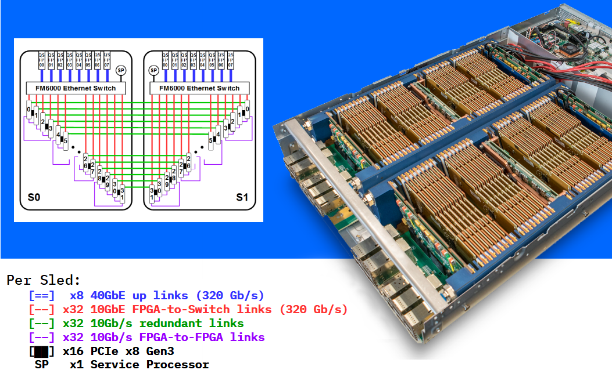

## Overview of cloudFPGA 

The **cloudFPGA (cF)** proposal is to promote FPGAs to become 1st class-citizens in **data centers
(DC)** by setting the FPGAs free from the traditional CPU-bus attachments and by making them 
plentiful in modern hyperscale DCs. 
* The first proposition is carried out by **disaggregating** the FPGAs from the server nodes and by 
  connecting the FPGAs directly to the DC network. As a result, FPGAs can communicate with other 
  CPUs and FPGAs in the DC network with low latency and high bandwidth .
  
* The second is achieved by turning the FPGAs into **standalone network attached** FPGAs while densely
  packing them into DC chassis and racks. From that prospect, FPGAs become autonomous and 1st class-compute
  nodes that can be reached anywhere in the DC via their IP address. 
  
 
### The cloudFPGA Service Architecture

In the cloud computing universe, a **CPU Instance** is a hardware resource (such as a server or a 
virtual machine) combined with the image of an operating system (such as _Linux_ or _Windows_). 
Next, different types of CPU instances are offered in the Cloud based on varying hardware 
capabilities such as clock frequency, #cores, memory size, computing power, etc. Finally, when 
deploying a workload on the Cloud, users select the CPU instance that best matches the requirements 
of their application.
 
The cloud service architecture of cloudFPGA is comparable to a cloud service hosting traditional 
servers and virtual machines when considering the following correlation cases:
* in cF, the equivalent of the CPU-based hardware resource is an FPGA device and its surrounding 
  board components. We refer to such an FPGA card as an **FPGA module (MOD)**. 
* in cF, the equivalent of the OS kernel is a piece of reconfigurable logic that contains the 
  custom interfaces and run-time logic to host and run a workload. We refer to such a kernel  
  implemented in logic gates as a **Shell**. 
 
As a result, the counter part of a CPU instance is an **FPGA Instance** and we can draw the 
following parallels:

| Instance Type | Description            |         
| :-----------: | :--------------------- |
| CPU_Instance  | Hw_Resource + OS_Image |
| FPGA_Instance | FPGA_Module + Shell    |

With respect to the above definition of an FPGA Instance, we further refer to an **FPGA Cluster** 
as a set of _N_ FPGA Instances.

| Cluster Type | Description             |
| :----------: | :---------------------- |
| CPU_Cluster  | *N* * CPU_Instances     |
| FPGA_Cluster | *N* * FPGA_Instances    |

  
### The cloudFPGA Development Flows

A cloudFPGA application is referred to as a **Role (ROL)** and it is typically deployed using 
**Partial Reconfiguration (PR)** over the data center network. 
The various design flows for developing and deploying FPGA bitstreams of such ROL applications, 
are presented in the figure below.  
 * the leftmost situation depicts a user working on a **remote machine** to develop his application 
   and later deploy it on a single cloudFPGA instance (represented here as a little _yellow square 
   box_ at the bottom of the figure). In this remote scenario, the user's computer is expected 
   to supervise the FPGA instance located in our on-premises Cloud infrastructure, and to feed it 
   with appropriate data and commands.    
 * the middle case shows a user developing with a **Virtual Machine (VM)** hosted in our 
   on-premises Cloud infrastructure and later deploying his application on multiple FPGA 
   instances. Obviously, the preferred way to manage these duplicated FPGA instances is to re-use 
   that VM or a similar one located in the same Cloud infrastructure. 
 * the rightmost columns exemplifies a user deploying **multiple VMs** as well as **multiple 
   clusters of FPGAs**.
   

To produce a bitstream in the above scenario #1, you may use the Xilinx design tool version of your 
choice. In return, you must be able to check out any corresponding product license (if required) 
on your own.
For the scenario #2, we offer a pre-installed _Linux_ distribution (typically _CentOS_) and a free 
Xilinx Vivado installation (typically _Vivado 2017.4_).   

### The cloudFPGA Research Platform

The **cloudFPGA Research Platform (cFRP)** is a 2U height by 19 inches wide chassis featuring 64 
FPGA instances. The chassis is equipped with two sleds (S0, S1), each sled consisting of 
32 FPGA instances connected to an Intel FM6000 Ethernet switch via a carrier board. The FM6000 
acts as a leaf switch that aggregates 32x10GbE links from the FPGAs and exposes them to a 
higher-level spin network via 8x40GbE up-links. This amounts to a bi-sectional bandwidth of 
640 Gb/s per sled.
 

 
Next, a **cloudFPGA Infrastructure** consists of numerous such cFRMs assembled into one or  
multiple DC racks. Note that knowledge of the cFRP is not required for developing with cloudFPGA. 
The only concept that a user must grasp, is that IP-based switching and routing among FPGAs and 
CPU servers provide DC-wide end-to-end connectivity and flexibility.

However, the above cFRP details might be relevant to advanced users who seek ultra low-latency and 
who may want to deploy their cluster on FPGAs which are spatially close in a sled, a chassis or 
a rack.  

### The cloudFPGA Development Kit

A cloudFPGA application builds on the design pattern referred to as **Shell Role 
Architecture (SRA)**. This design separates the platform-specific parts (i.e. the _Shell_) from the 
application-specific parts (i.e. the _Role_) to increase the re-usability and to isolate the two 
parts. 

* The **Shell (SHL)** contains all necessary I/O components, the run-time modules and the network 
 stack that hooks the FPGA to the DC network. It further abstracts all these hardware components 
 by exposing standard _AXI interfaces_ to the user. From a computer operating system perspective, 
 the Shell can be seen as the conceptual counterpart of the kernel space.

* The **Role (ROL)** is the application-specific part of the FPGA logic. It embeds the user's 
 custom application and can be assimilated to a CPU application executed in user space. 

Multiple shell architectures might be available for a given 
[FPGA module (MOD)](#the-cloudfpga-service-architecture). Once a user has decided for a module  
and a shell to run his role, it is the duty of the cloudFPGA development kit to assemble
the tuple *{MOD, SHL, ROL}* into a so-called **cloudFPGA Project (cFp)**. The 
[cFDK](https://github.com/cloudFPGA/cFDK/) repository contains all the source code, the 
documentation and the build scripts that are necessary to create such a cloudFPGA project. 

#### User Privilege Layers
Depending on the commitment sought by the user, the cFDK offers two kind of development experiences 
characterized by different levels of protection.

* **common users** are unprivileged users who use the development kit to build their custom 
  hardware accelerated application, generate an FPGA bitstream and run it on a cloudFPGA instance.
* **privileged users** are granted the right to modify an existing shell or to create one with new
  features. This status must be requested and authorized by the *cF team*.  
 
Warning: The cFDK is only available for **Linux** operating systems.

### The cloudFPGA Organization

The cloudFPGA organization is a central places for sharing and hosting cloudFPGA related projects
and collaborations. As of today, the organization consists of two main types of repositories: 
* repositories which are part of the cloudFPGA core system such as:
    * the [cFDK](https://github.com/cloudFPGA/cFDK/) which contains a framework to help implement 
      your FPGA application on a cloudFPGA research platform,
    * the [cFSP](https://github.com/cloudFPGA/cFSP) which includes a support library for accessing
      the data and control paths of a cloudFPGA instance.
    * the [cFCreate](https://github.com/cloudFPGA/cFCreate) tool which eases the creation and the 
      update of cloudFPGA projects,
    * the [Doc](https://github.com/cloudFPGA/Doc) repository which contains the generic cloudFPGA 
      documentation used to build the *GitHub* pages that you are currently reading.
    * the [Dox](https://github.com/cloudFPGA/Dox) which is used to generate the *Doxygen* formatted
      documentation of the cFDK.
* repositories which contain specific cloudFPGA projects developed by the community such as:
    * [cFp_HelloKale](https://github.com/cloudFPGA/cFp_HelloKale) a '*Hello world*' project based 
      upon the shell '*Kale*', 
    * [cFp_HelloThemisto](https://github.com/cloudFPGA/cFp_HelloThemisto) a '*Hello world*' project 
      based upon the shell '*Themisto*', 
    * [cFp_Zoo](https://github.com/cloudFPGA/cFp_Zoo) a set of domain-specific accelerators for 
      the hybrid multi-cloud era, including some of the open source *Vitis Library* adapted for
      the cloudFPGA platform.
    
:Info: By convention, the repository's name of a cloudFPGA project is always 
    pre-pended with the string \"**cFp_**\" for *cloudFPGA project*.
    
    
    