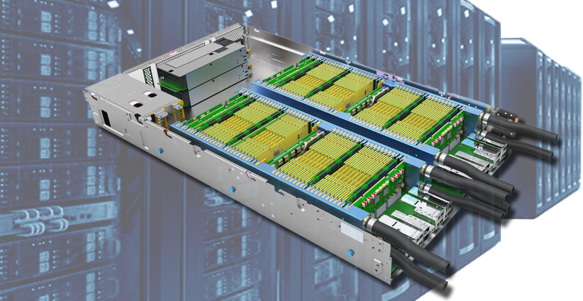

## Overview of the cF Project

Stand-alone network-attached FPGA

The concept of stand-alone network-attached FPGA builds on two main initiatives:

1. Changing the traditional way of attaching an FPGA to a CPU by moving from PCIe attachment to network attachment.

2. Promoting the FPGAs to the rank of remote peer processors by disaggregating them from the servers and provisioning them as independent and self-managed resources in the cloud.

<b>Figure-1: Different interconnections for FPGA accelerators.</b>

 

The network attachment sets the FPGA free from the traditional CPU–FPGA attachment by connecting the FPGA directly to the DC network. As a result, the number of distributed FPGAs becomes independent of the number of servers.

### Hyperscale infrastructure

To enable cloud users to rent, use and release large numbers of FPGAs on the cloud, the FPGA resource must become plentiful in DCs.

<b>Figure-2: cloudFPGA concept.</b>

 

The cloudFPGA infrastructure is the key enabler of such a large-scale deployment of FPGAs in DCs. It was designed from the ground up to provide the world’s highest-density and most energy-efficient rack unit of FPGAs.

The infrastructure combines a passive and an active water-cooling approach to pack 64 FPGAs into one 19"×2U chassis. Such a chassis is made up of two Sleds, each with 32 FPGAs and one 64-port 10GbE Ethernet switch providing 640 Gb/s bi-sectional bandwidth.

In all, 16 such chassis fit into a 42U rack for a total of 1024 FPGAs and 16 TB of DRAM.

### Accelerator Service

Management of Cloud FPGAs at scale

Today, the prevailing way to incorporate an FPGA into a server is to connect it to the CPU over a high-speed, point-to-point interconnect such as the PCIe bus, and to treat that FPGA resource as a co-processor worker under the control of the server CPU.

However, because of this master–slave programming paradigm, such an FPGA is typically integrated in the cloud only as an option of the primary host compute resource to which it belongs. As a result, bus-attached FPGAs are usually made available in the cloud indirectly via Virtual Machines (VMs) or Containers.

In contrast, in our deployment a stand-alone, network-attached FPGA can be requested independently of a host via the cloudFPGA Resource Manager (cFRM, see figure). The cFRM provides a RESTful (Representational State Transfer) API (Application Program Interface) for integration in the Data Center (DC) management stack (e.g. OpenStack).

<b>Figure-2: High level view of cloudFPGA architecture.</b>

 

Cloud integration is the process of making a resource available in the cloud. In the case of cloudFPGA, this process is done by the combination of three levels of management (see Figure): A cloudFPGA Resource Manager (cFRM), a cloudFPGA Sled Manager (cFSM), and an cloudFPGA Manager Core (cFMC).

1. There is one resource manager per DC to control many Sleds. The cFRM handles the user images and maintains a database of FPGA resources.
2. There is one sled manager for every 32 FPGAs. The cFSM runs on a service processor that is part of the Sled. It powers the FPGAs on and off, monitors the physical parameters of the FPGAs, and runs the SW management stack of the Ethernet switch.
3. There is one cFMC per FPGA. The cFMC contains a simplified HTTP server that provides support for the REST API calls issued by the cFRM.

In the end, the components of all levels work together to provide the requested FPGA resources in a fast and secure way.

System architecture for the cloudFPGA platform. 32 FPGAs, one switch and a service processor are combined on one carrier board and called a Sled. The management tasks are split into three levels — cloudFPGA Resource Manager (cFRM), cloudFPGA Sled Manager (cFSM), and cloudFPGA Manager Core (cFMC). A Sled is half of a 2U chassis. The OpenStack compute resources (Nova) CPU nodes are also available for creating heterogeneous clusters.
